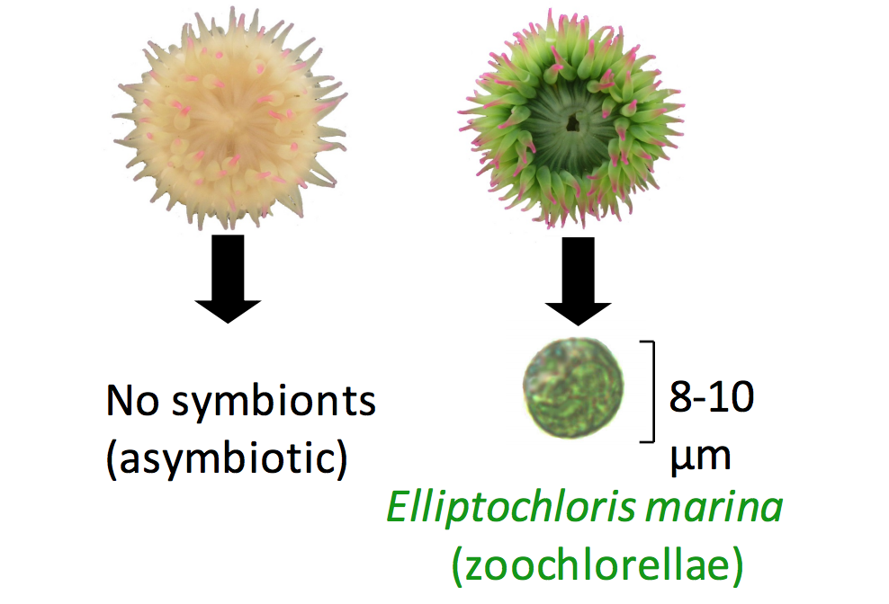

# Is differential DNA methylation associated with symbiosis in a sea anemone?

Symbiosis with dinoflagellates and other algae is widespread among cnidarians such as corals and sea anemones. Symbiosis in these organisms is associated with physiological changes that are in turn driven by changes in gene expression. Recent studies have also identified changes in DNA methylation patterns that may be driven by symbiosis. This project tests the hypothesis that the symbiotic phenotype is associated with differential DNA methylation. The project leverages the full length reads and sensitivity to base modifications possible using nanopore sequencing.

Samples: n= 3 aposymbiotic and n= 3 symbiotic _Anthopleura elegantissima_ hosting the chlorophyte _Elliptochloris marina_. Specimens were collected within ~10 cm of each other on the underside of a boulder, and likely represent a single clone. Specimens were flash frozen within one hour of collection. These specimens were chosen to minimize environmental and genetic effects.

# Methods overview

Step 1: Sequence DNA using Oxford Nanopore Rapid and Ligation Sequencing protocols.

Step 2: Compare nanopore-derived methylation to CpG depletion estimates in a published transcriptome (Kitchen et al. 2015).

Step 3: Generate A. elegantissima draft genome.

Step 4: Call methylation in nanopore reads using nanopolish (Simpson et al. 2017) and compare methylation in symbiotic and non symbiotic individuals.

## Library preparation and sequencing

DNA libraries were prepared according to the [Oxford Nanopore Ligation Sequencing with Native Barcoding protocol](./1D-Native-barcoding-genomic-DNA-with-EXP-NBD103-and-SQK-LSK109.pdf). Libraries were sequenced in duplex (two barcoded samples per library) on three FLO-MIN106 MinION flow cells. Additionally, one asymbiotic specimen was also prepared according to the [Oxford Nanopore Rapid Sequencing protocol](./rapid-sequencing-sqk-rad004-RSE_9046_v1_revB_17Nov2017.pdf). Libraries were sequenced on two FLO-MIN106 MinION flow cells. The data produced from the Rapid Sequencing libraries were used only for genome assembly and not methylation analysis.

## Genome assembly 

A draft _A. elegantissima_ genome was generated using only aposymbiotic specimens with the program [wtdbg2](https://github.com/ruanjue/wtdbg2). The draft genome comprises 243 Mb, including 5359 contigs with an N50 of 87 kb and N90 of 19.2 kb. 

## Analysis 

[Nanopolish](https://nanopolish.readthedocs.io/en/latest/) was used for methylation calling of raw nanopore FAST5 reads. 

## Software

This study made use of the following software:

MacOS 10.12.5
ONT MinKNOW 1.15.4
ONT Albacore Sequencing Pipeline 2.3.3
Porechop 0.2.4 
minimap2 2.14 
Nanopolish 0.10.1 
wtdbg 2.1
methplotlib 0.1.1 

#### R:
R version 4.0.3
ggplot2 3.3.2
factoextra 1.0.7
ggpubr 0.4.0
cowplot 1.1.1

## Directory structure

`analyses/` - Key files resulting from analyses.

`data/` -  Mostly raw data, including the transcriptome and draft genome.

`images/` - Mostly figures.

`notebooks/` - Jupyter notebooks.

`protocols/` - Library preparation protocols.

`scripts/` - Scripts such as R scripts used for analyses.